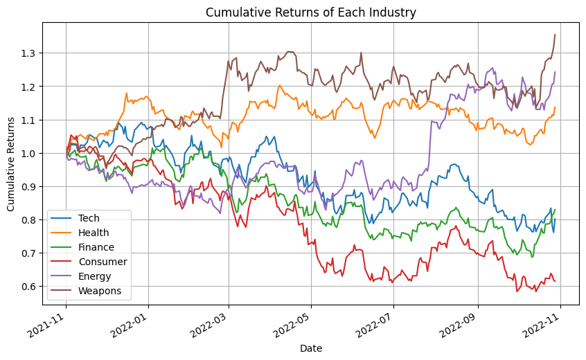
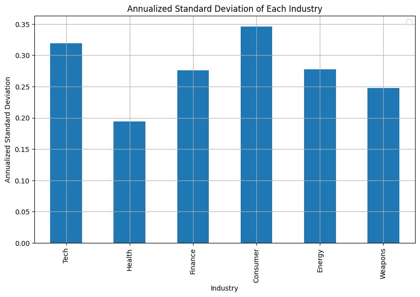
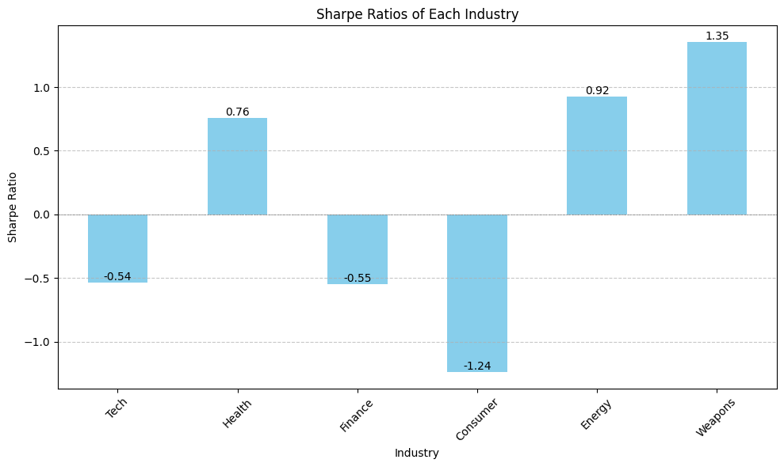

# Project1 : Stockscape - Portfolio Analysis in the Socio-Economic Playground 
------
## Background 
In today's dynamic global economy, investors are constantly seeking strategies to optimize their portfolios and maximize returns while mitigating risks. In line with this objective, our project delves into the intricacies of portfolio performance optimization through a comprehensive analysis of six key industries spanning a five-year period. By examining the performance of these industries, we aim to uncover underlying trends and patterns that can be validated against the backdrop of the socio-political and economic landscape prevailing during this time frame.
___
## Importance of Socio-Political and Economic Climate and Driving Investor Decisions
Understanding the broader socio-political and economic climate is crucial in interpreting the performance of industries accurately. Factors such as regulatory changes, government policies, geopolitical tensions, and macroeconomic indicators significantly influence market dynamics and sectoral performance. By validating our data's trends within these parameters, we can provide investors with a deeper understanding of the underlying drivers shaping industry trends and thereby enable them to make informed decisions about their portfolios. Armed with this knowledge, investors can proactively adjust their portfolio allocations to capitalize on emerging trends or shield themselves from potential downturns, thereby safeguarding their investments and enhancing long-term returns.
In addition, overlaying regional data such as unemployment rates onto our industry analysis, we aim to identify correlations and interdependencies between economic indicators and industry performance. This cross-referencing enables investors to discern regional nuances and tailor their investment strategies accordingly, ensuring alignment with both sectoral trends and local economic conditions.
___
## Project Scope 
At its core, our project seeks to bridge the gap between data-driven analysis and practical investment strategies. By visualizing the long-term dynamics of stocks within specific industries, we aim to equip investors with actionable recommendations that transcend short-term market fluctuations. Our findings offer tangible implications for portfolio construction and asset allocation, empowering investors to navigate volatile market environments with confidence and resilience. Ultimately, our goal is to empower investors with the knowledge and insights needed to achieve their financial objectives in an ever-evolving investment landscape. 

---
Our project focuses on optimizing portfolio performance by analyzing six industries' performance over the past five years. We aim to validate trends in our data based on the political and economic climate during this period. This analysis will provide investors with insights on portfolio positioning to safeguard their investments. 
Additionally, we will emphasize geographic data to visualize regions with political party affiliation and cross-reference them with relevant industries.

## 1. Initial Data from yfinance
    - We chose the top 6 industries (Technology, Healthcare, Financial, Consumer Discretionary, Energy, and Weapons Manufacturing) and 3 stocks of each
    - Defined stock ticker and date range, and dowloaded the data it Yahoo Finance 
  
## 2. Creating a Database of Each Stock
    - Created a DataFrame of the closing prices and dates of each stock per industry 
    - Combined all stocks from the 6 industries into a single DataFrame: `custom_portfolio_df`
    - Assigned the close column to a new DataFrame :`small_df`
    - Used the `.columns` attribute to assign new column names to the DataFrame `small_df` 
    - Created a new DataFrame that includes only columns correspondent ton the stock of each industry :
  `tech_df = small_df[['AAPL', 'MSFT', 'GOOG']]`
  `health_df=small_df[['JNJ','PFE','UNH']]`
  `finance_df=small_df[['JPM','BAC','V']]`
  `consumer_df=small_df[['AMZN','NKE','DIS']]`
  `energy_df=small_df[['XOM','FSLR','NEE']]`
  `weapons_df=small_df[['LMT','RTX','NOC']]`

## 3. Calculate Daily Returns and Weighted Returns 
- Calculated Daily Returns of each industry in order to do a performance comparison
  `tech_daily`
  `health_daily`
  `finance_daily`
  `consumer_daily`
  `energy_daily`
  `weapons_daily`
- Dropped Nulls 
- Generated a combined Daily Returns DataFrame 
- Renamed each column with the ticker' name  
- Set weights (1/3)  
- Created an empty dictonary to store the returns of each sector  
___
## 4. Risk Analysis Performance 
- Cumulative returns of Each Industry  
  A higher cumulative return observed in the weapons industry indicates that the investment has experienced more significant overall growth or positive performance over a one-year period. 

- Annualized Standard Deviation  
  In the consumer industry, a higher standard deviation is indicative of greater variability in the investment's returns, suggesting increased risk and potential for greater fluctuations over a one-year period.

  In the health industry, a lower standard deviation suggests reduced variability in the investment's returns, indicating a relatively lower level of risk and a tendency for more stable performance over the specified time period.

- Annualized Sharpe Ratios  
  In the weapons industry, a Sharpe ratio of 1.35 is a positive signal, indicating that the industry has achieved a good balance between returns and risk. 
  In the consumer industry, a Sharpe ratio of -1.24 signals a negative risk-adjusted performance, implying that the investment has not effectively balanced returns relative to the level of risk undertaken within the specified time period. 
The proximity to zero, as indicated by the 0.54 value, suggests a moderate level of risk-adjusted return within the Tech industry, indicating a comparatively lower investment risk. 

---
## 5. Statistical Analysis
  
- Analysed the  performance of each industry during time frame - 1 year before midtern, 1 year after midterm -- do this for 5 different terms  
- Analysed the performace of each industry during Ukraine - Russia war  
- Calculate the average growth of each industry 
- Top performing industries get put into a portfolio weighted accordingly 

**Midterm 1:**
12 Months Before 
2013-11-01 to 2014-10-31
 12 Months After 
2014-11-01 to 2015-10-31

**Midterm 2:**
 12 Months Before 
2015-11-01 to 2016-10-31 
 12 Months After 
2016-11-01 to 2017-10-31

**Midterm 3:**
12 Months Before 
2017-11-01 to 2018-10-31
 12 Month After 
2018-11-01 to 2019-10-31

**Midterm 4:**
12 Months Before 
2019-11-01 to 2020-10-31
 12 Months After 
 COVID SO THIS IS AN ANOMALY: 2020-11-01 to 2021-10-31

 **Midterm 5:**
12 months Before 
2021-11-01 to 2022-10-31
12 Months After 
2022-11-01 to 2023-10-31

**Upcoming Election that hasn't occurred yet: 12 Months Before**
Predictions on how well our portfolio will do before the next major election 
2023-11-01 to 2024-10-31

---
## 6. Data Visualization 

